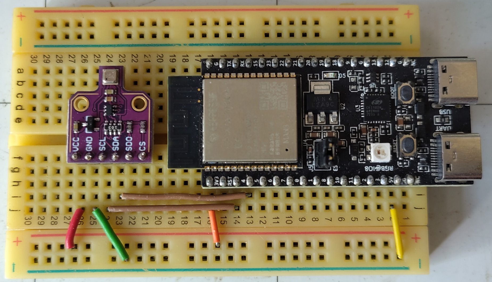
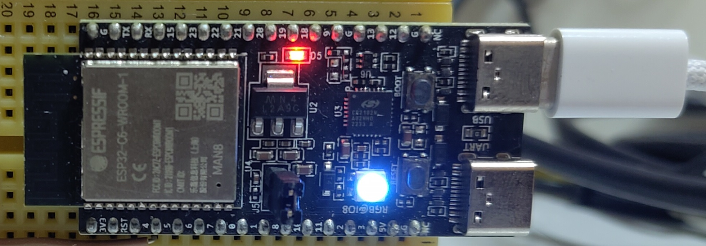

# swift-embed-experiment

My personal experiments on Embedded Swift on ESP32-C6-DevKitC-1 devboard talking to BME280/BME680 I2C sensors.



Connecting with BME680 breakout board.



Using LGB LED

## Initial Setup
```bash
# Install Swiftly to managed Swift installation as only snapshot will have
brew install swiftly

# Use latest snapshot
swiftly install main-snapshot
# Version used in repo
swiftly install main-snapshot-2025-06-22

swiftly use main-snapshot-2025-06-22

# Confirm snapshot is in use
swiftly list

# Install dependencies for ESP-IDF
brew install python3 cmake ninja dfu-util ccache
mkdir -p ~/esp

# Assume ESP stuff is in this directory.
cd ~/esp
git clone -b v5.4.2 --recursive https://github.com/espressif/esp-idf.git
cd ~/esp/esp-idf
./install.sh esp32c6
```

Reference: https://docs.espressif.com/projects/esp-idf/en/v5.4.1/esp32c6/get-started/linux-macos-setup.html

## Per-project


```bash
# cd to chosen project

cd esp32-led-strip-sdk
cd esp32-bme280-c-wrapper
cd esp32-bme280-swift-wrapper
cd esp32-bme680-c-wrapper

# Prepare environment
. $HOME/esp/esp-idf/export.sh

# Build the project
idf.py clean
idf.py set-target esp32c6
idf.py build

# Flash to auto-detected USB Device path. Flash will also build the image if not built.
idf.py flash

# Flash to specific USB Device path
idf.py -p /dev/cu.usbmodemXXXXX flash

# Monitor serial port
idf.py monitor

# Can also do this for shortcut
idf.py flash && idf.py monitor
```

## Sources
1. https://github.com/boschsensortec/BME280_SensorAPI
2. https://github.com/boschsensortec/BME68x_SensorAPI
